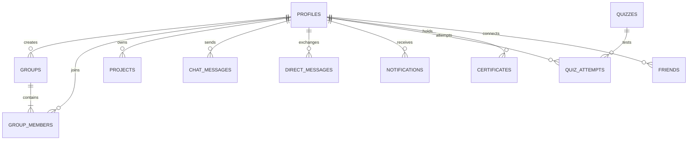

# Entity Relationship Overview

```mermaid
erDiagram
    PROFILES ||--o{ GROUPS : creates
    PROFILES ||--o{ GROUP_MEMBERS : joins
    GROUPS ||--|{ GROUP_MEMBERS : contains
    PROFILES ||--o{ PROJECTS : owns
    PROFILES ||--o{ CHAT_MESSAGES : sends
    PROFILES ||--o{ DIRECT_MESSAGES : exchanges
    PROFILES ||--o{ NOTIFICATIONS : receives
    PROFILES ||--o{ QUIZ_ATTEMPTS : attempts
    QUIZZES ||--o{ QUIZ_ATTEMPTS : tests
    PROFILES ||--o{ CERTIFICATES : holds
    PROFILES ||--o{ FRIENDS : connects
```
